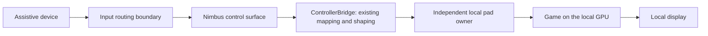

# Input Ownership: A First-Principles Solution Pass

**Status:** Proposal for review, 2026-09-14. Based on the current source, recorded project experiments and the primary sources linked below. No new hardware or game measurements were made for this pass. Numerical targets remain proposals.
**Problem:** [Input Ownership: Problem Statement](PROBLEM_STATEMENT.md).
**Revision note:** the problem statement was revised later on 2026-09-14 and now carries several comments from sections 3 and 4 below: native Linux on the same PC is a row, Raw Input delivery is stated conditionally, "any failure" is a listed fault set with the pointer winning a conflict, the "no kernel anti-cheat" claim is sourced as reports, "only intended commands" replaces an exclusive pad, and the VM latency is given as distributions (the "two to five frames at the median" summary was corrected in the VM document too). Where this document quotes the earlier wording, the problem statement is the current text.
**Technical comments:** [Section 8](#8-detailed-technical-comments) connects the proposal to current code, specifies candidate contracts and identifies races the implementation must resolve. These comments describe proposed work, not implemented behavior.

## 1. Recommendation

Keep the game rendering locally on the best GPU. Choose how to exclude pointer input separately from how to keep controller state safe.

1. **Test Forza's settings and background behavior first.** A game that accepts the pad while Nimbus has focus, without reacting to the pointer or throttling, may need no new input interception.
2. **Identify where this assistive device becomes a mouse.** If its existing software can send Nimbus coordinates and clicks while stopping its own mouse output, route there. This possibility depends on the actual device and its supported APIs.
3. **Add native Linux to the alternatives.** Nimbus and Forza under Proton can run on the same physical PC and GPU, with no guest or video stream. This option is missing from the problem statement's table. It depends on the device working on Linux, the game edition, performance and an accessible way to manage the OS.
4. **Give the virtual pad a lifetime independent of the Nimbus window.** A small local process can keep the pad connected and neutralize it when the UI stops responding. This is needed even if the isolation problem is solved by a game setting.
5. **Keep the Windows mouse filter conditional on recovery evidence.** Its measured isolation is useful, but its current installation model fails the stated bad-update requirement. Signing and a runtime watchdog alone do not close that gap.

If Windows is mandatory, the pointer is an ordinary mouse with no source-level integration, and Forza rejects the focus/settings approach, the repository does not currently contain an answer that satisfies every requirement. That is a useful decision result: it identifies the remaining engineering problem rather than treating a working isolation demo as a complete solution.

## 2. The invariant is ownership during a session

A pointing device produces information. That information need not become a desktop mouse event before Nimbus can use it. The required path during play is:



The routing boundary may be cooperation from the game, an API in the device software, an OS input grab, or a filter. The renderer does not need to cross that boundary.

Ownership also has to change when the player leaves the control surface:

| Session state | Pointer destination | Gamepad state |
|---|---|---|
| Desktop / preparing | Normal desktop | Connected and neutral once prepared |
| Playing | Nimbus and its required dialogs | Fresh commands from Nimbus |
| Recovering from a UI failure | Normal desktop, restored automatically | Same pad, neutral |
| Ready after recovery | Normal desktop | Neutral until the player explicitly resumes |

**Pointer recovery takes priority over isolation during a fault.** Restoring the desktop mouse may let the game see mouse input again. The no-leak requirement applies while Playing; a recovery transition must be allowed to end that state.

Likewise, "pad reaches only the game" should mean that only intended commands affect gameplay and that Steam or another mapper does not turn the pad back into desktop mouse/keyboard input. An ordinary virtual XInput controller is not a private per-process channel. Literal exclusion from every other process is a stronger requirement needing its own boundary.

## 3. Separate constraints from assumptions

### The fixed computer does not imply a fixed operating system

The problem fixes the pointer's computer, the GPU and a software-only approach. It does not explicitly require Windows to remain the active OS. The cost of changing OS is substantial, but it is a decision variable, not a physical impossibility.

Playground Games announced Forza Horizon 6 as Steam Deck Verified and explicitly names SteamOS support. That establishes a credible route for the Steam edition through Proton. It does not establish compatibility with this assistive device, the Xbox app edition, the RTX 5090 desktop configuration, or the proposed 95 percent performance target. [Official Steam Deck announcement](https://forza.net/news/forza-horizon-6-steam-deck)

### Raw Input is conditional, and focus is a hypothesis

Windows applications register for Raw Input. Foreground delivery is the default for a matching registration; a background receiver can request `RIDEV_INPUTSINK`. Two monitors do not change those registrations. Nimbus registering for input does not take another application's registration away. [Microsoft Raw Input overview](https://learn.microsoft.com/en-us/windows/win32/inputdev/about-raw-input), [RAWINPUTDEVICE flags](https://learn.microsoft.com/en-us/windows/win32/api/winuser/ns-winuser-rawinputdevice)

Therefore the test is whether this version of Forza ignores the pointer while it is unfocused and still plays normally. The document's broad statement that every focused game receives every pointer should be narrowed accordingly. Mouse messages, cursor polling and other input APIs also need behavioral checks.

### A mode pulse is not input ownership

A periodic pad event can win the game's most-recent-device decision while mouse input still arrives. It may make play acceptable, but passing a prompt-glyph check alone does not establish isolation. Check steering, camera, menu selection and pauses independently. A cosmetic controller-icon lock has the same limitation.

### "Any failure" is not an implementable software guarantee

No application can keep a pointer working through a kernel crash, failed hardware or loss of power. Define the faults Nimbus must tolerate, and name the component assumed to remain operational for each one.

This qualification must not excuse the known filter incident. A Nimbus driver update or load refusal that leaves Windows running but disables the player's only mouse is an in-scope product failure. The [driver runbook](../../driver/README.md) records exactly that failure on 2026-09-07.

An emergency keyboard shortcut is also insufficient for someone whose only usable input is the pointer. Recovery from a frozen UI must be automatic; deliberate Stop must be reachable through the same assistive device while the UI is healthy.

### Game acceptance remains a measured property

The Steam listing specifies DirectX 12. Neither an absent anti-cheat label nor Steam Deck support proves that a Windows filter, virtual pad or VM is accepted in every game mode. Treat the problem statement's "no kernel anti-cheat" claim as unverified here and record behavior for the actual build and edition. [Forza Horizon 6 on Steam](https://store.steampowered.com/app/2483190/Forza_Horizon_6/)

## 4. Choose the least costly boundary that passes

### A. Game settings or Nimbus in the foreground

Run the game borderless on one display and Nimbus on the other. Test with Nimbus accepting focus and with isolation and controller-mode pulses disabled. This differs from Nimbus's Game Focus Mode, which preserves the game's foreground.

This is the first choice if the game keeps rendering, accepts every required pad control, ignores pointer operation and does not pause or reduce performance. Include menus and returning from another desktop application. A single successful driving segment is insufficient.

### B. Input before mouse conversion

If the existing assistive software exposes an appropriate SDK or command stream, it could send coordinates, button edges and scrolling to Nimbus without also emitting OS mouse events during play. Nimbus can deliver those to its QML surface through the existing bridge boundary.

Reading a second copy of the data is insufficient: the original mouse output must actually stop. The vendor's mechanism must also restore desktop control when Nimbus fails, without needing Nimbus's own frozen window to do it. Otherwise this simply relocates the lockout risk.

This is a conditional design opportunity, not a claim about the unnamed device. Standard mouse HID collections cannot simply be exclusively opened by Nimbus on Windows; Microsoft documents their exclusive system ownership and distinguishes vendor-specific collections. [Microsoft mouse/HID architecture](https://learn.microsoft.com/en-us/windows-hardware/drivers/hid/keyboard-and-mouse-hid-client-drivers)

### C. Linux on the same PC, Forza under Proton

The intended path is the existing Linux `MouseIsolation` capture, Nimbus's local UI, and a `uinput` gamepad. A compositor may help presentation, but the input grab is the separation mechanism in this design.

The repository already implements this in [mouse_isolation.py](../../src/mouse_isolation.py) and [uinput_interface.py](../../src/uinput_interface.py). The [Linux proposal](LINUX_GAMING_PROPOSAL.md) already describes process supervision and recovery; extend that design rather than starting another architecture.

An evdev grab is released when its owning file is closed. A hung process can keep that file open, so process supervision is still required. No other process should inherit or retain a duplicate of the captured descriptor. The kernel's implementation handles the grab and its release in `evdev_grab`, `evdev_ungrab` and `evdev_release`. [Linux evdev source](https://github.com/torvalds/linux/blob/master/drivers/input/evdev.c)

Before selecting this route, prove all of the following on the reference setup:

- The assistive pointer works at login, in Nimbus, on the desktop and during recovery. Required companion software is available. Rebooting between OS installations must not force re-pairing or inaccessible keyboard interaction.
- The actual device's event types are supported. The current Linux implementation deliberately declines absolute pointers it cannot translate safely.
- The owned game edition can run through the proposed distribution path. Steam Deck support alone does not establish a path for an Xbox app installation.
- The RTX 5090, both monitors and selected graphics settings meet measured latency and performance targets.
- A frozen Nimbus restores the same physical pointer and leaves the game's existing pad neutral.

This retains the hardware constraints. It pays an OS migration and maintenance cost, which may still make it unsuitable for this player.

### D. Windows mouse filtering

This remains the repository's demonstrated Windows mechanism for withholding `mouclass` packets. There are four different safety questions:

| Failure | Existing protection | Remaining gap |
|---|---|---|
| Capture process exits | Handle cleanup restores pass-through | Pad lifetime and neutralization are separate |
| Entire capture process stops issuing reads | Driver's 2-second read watchdog | Does not meet a 150 ms pad deadline |
| Qt UI freezes while reader keeps running | Reader continues renewing driver liveness | Reader health does not prove usable controls |
| Registered filter is refused at device startup | Runtime watchdog cannot execute | Mouse can remain unavailable |

The first three findings follow from [mouse_isolation_win.py](../../src/mouse_isolation_win.py), the bridge's queued isolation callbacks, and the [driver watchdog](../../driver/nimbus_moufilter/nimbus_moufilter.c). The last is the recorded incident in the driver runbook.

Microsoft signing addresses some load failures. Per-device attachment reduces the number of affected devices. Neither proves that the sole selected pointer survives an unavailable filter. A preflight or rollback script helps only if it can run without the pointer and can recover the relevant failure.

Consequently, the current filter fails the stated update-safety gate. Advancing it requires an independently demonstrated recovery design and a defined remaining fault envelope. It cannot be marked compliant by adding a faster heartbeat.

### E. VM, another Windows desktop, or another computer

Keep these as conditional research paths. A separate computer conflicts with the fixed best-GPU requirement in this setup. A VM keeps that GPU but introduces guest compatibility and presentation costs.

A second Windows desktop is worth distinguishing from a VM, but `CreateDesktop` alone is insufficient: only one desktop in the interactive window station is active and visible at a time. A candidate would still need to demonstrate concurrent game rendering, pad delivery and a fast view of the inactive desktop. It is not a proven two-monitor shortcut. [Microsoft desktops documentation](https://learn.microsoft.com/en-us/windows/win32/winstation/desktops)

The existing Hyper-V experiment is evidence about one implementation on the AMD test machine. Its section 10.8 table reports native press latency at **12.8 ms p50**, versus **29.9 to 46.0 ms p50** through the guest. The guest p95 is **46.9 to 79.7 ms**, against **13.5 ms** native. The table does not support summarizing this as an additional two to five frames at the median. The method detects a composed desktop image in software; it is not a physical input-to-photon measurement. [VM measurements](VIRTUAL_MACHINE_FEASIBILITY.md#108-gate-d-the-axis-that-could-be-measured-latency)

Those results do not establish compliance with the proposed one-frame budget; several distributions exceed it even against the software baseline. They do not prove every VM implementation fails, or establish performance on the RTX 5090. Similarly, describe the filter as avoiding a video-stream round trip; a literal zero-delay claim requires a measurement resolution and baseline.

## 5. Make controller lifetime independent of UI lifetime

This is the common implementation proposal across the viable boundaries.

### One local process owns the pad

A small, separately supervised user process creates the virtual controller before the game launches and owns it for the game session. The QML UI continues to use `ControllerBridge`. Existing shaping stays in the bridge/configuration layer; the pad owner validates and submits the resulting state through the backend API.

Use a local IPC channel restricted to the session's user. A privileged service or network listener is not needed merely to separate lifetimes. Every producer, including pulses and scripted actions, must go through the same state owner so nothing can write a held input after recovery has neutralized it.

Reuse the ideas already explored in the [Linux proposal](LINUX_GAMING_PROPOSAL.md#44-command-and-state-protocol), [network pad](SEPARATE_GAME_MACHINE.md#32-a-network-receiver-layout-d) and [pad-bus plan](PAD_BUS_FORK_PLAN.md). Their timing and lifetime policies differ; this proposal does not silently replace those decisions.

### Continued output needs evidence of a responsive UI

Treat each non-neutral state as permission that expires unless the control surface remains responsive. This is a short **lease** on the held controls.

- Renew the lease through the Qt event loop that handles the controls. A background sender repeatedly transmitting its cached state is not evidence of UI health.
- Test a rendering-only stall as well. If the control surface stops updating while the event loop runs, a heartbeat alone will miss that failure; the health contract must include timely completion of requested control-surface updates.
- Use expiring challenges or equivalent freshness checks. Buffered acknowledgements and old state must not revive an expired lease.
- Send new control changes immediately; do not wait for the next heartbeat. Retain complete state for recovery, and preserve ordered button edges so a short press/release cannot disappear between snapshots.
- On expiry, invalidate the session generation, cancel queued actions and pulses, and submit a complete neutral report: centered sticks, zero triggers and no pressed buttons.
- Recover the desktop pointer independently of Qt. In the existing capture design, a supervisor can terminate an unresponsive capture-owning UI process to trigger handle/descriptor cleanup. The pad-owning process stays alive.
- Keep the same pad connected while Nimbus restarts. Require a neutral state, release of stale gestures and explicit pointer-accessible Resume before accepting gameplay again.

Lack of pointer movement does not mean a failure. An intentional held throttle remains valid while the control surface is responsive. The lease tracks control-path health, not the time since the player last moved.

### Allocate the deadline instead of setting the timeout to 150 ms

The requirement concerns the game's observed neutral state. It includes expiry detection, scheduling, output submission and the game's next input sample:

`lease age + detection delay + neutral submission + game sampling <= 150 ms`

An initial experiment could allocate 100 ms to lease age, a 10 ms expiry-check interval and the remaining 40 ms to scheduling and delivery. These are proposed budgets, not established limits. They must be measured under CPU/GPU load. General-purpose Windows and a stalled game cannot supply an unconditional hard deadline.

The existing [pad-bus client](../../src/padbus_client.py) waits 1,000 ms before requesting cancellation of a pending report IOCTL, then waits for that request to finish. The complete call can therefore exceed one second, as well as the entire proposed budget. The prototype must measure that path and distinguish a healthy bus from an output-driver failure; putting the current call behind a timer is not sufficient. See [technical comment 8.8](#88-blocking-output-and-cancellation).

The [netpad game experiment](SEPARATE_GAME_MACHINE.md#103-a-real-game-left-4-dead-2-through-the-network-pad) demonstrates why neutral and disconnect are different: a 2.6-second sender freeze destroyed and recreated the pad, after which Left 4 Dead 2 stopped reading it. Preserve controller identity across UI recovery instead of assuming hotplug works.

### State the remaining failure boundary

| Fault | Proposed result | Assumption / limitation |
|---|---|---|
| UI crashes, freezes or loses IPC | Neutral within the measured deadline; same pad remains; pointer restored | Pad owner, supervisor, OS and output driver remain responsive |
| Capture reader hangs | Supervisor ends its owner and releases capture | Kernel handle cleanup succeeds |
| Pad owner hangs | Supervisor terminates it to close the device handle | Stock ViGEmBus can disconnect the pad; continuity is not guaranteed |
| Output driver stops accepting reports | Attempt neutral, end gameplay and report failure | Successful neutralization cannot be claimed without observation |
| Mouse filter fails to load | Existing design can lose pointer access | Does not satisfy the requirement |

If keeping the pad connected must also survive a pad-owner crash, the pad needs a lifetime and timeout enforced below that process, such as the proposed pad-bus work. An extra user-mode watchdog does not by itself provide that property. This is a separate, larger requirement from surviving a Nimbus UI failure.

## 6. The smallest experiments that decide the design

### Experiment 0: establish the actual input source

Record the device model, companion software, game edition and how motion, clicks and scrolling enter Windows. Distinguish mouse HID, absolute/digitizer input and software-generated events. Check for a supported direct-input API and a way to suspend its desktop mouse output.

This is observational discovery, not a reason to disable the player's device. A USB mouse test cannot prove coverage for an assistive application using a different input path.

### Experiment 1: isolate Forza's behavior on native Windows

Create a Forza-specific procedure before treating the existing harness as sufficient. There is no Forza recipe in `tests/games/` at the time of this pass.

| Case | Focus and configuration | What it establishes |
|---|---|---|
| Baseline | Game foreground, ordinary pad, pointer stationary | Normal control response and frame times |
| Pointer exposure | Game foreground, pointer active, isolation/pulse off | Which symptoms actually exist |
| Nimbus foreground | Nimbus accepts focus; game on other monitor; isolation/pulse off | Whether the cheapest boundary works |
| Game setting | Repeat with any actual mouse-ignore or input-lock setting | Whether the game can enforce the boundary itself |
| Existing Game Mode | Repeat with pulse enabled; record isolation separately | Whether symptom suppression is sufficient for the proposed behavioral target |

Keep a per-case record of Game Focus Mode, Game Mode, Isolate Mouse, Steam Input and any desktop gamepad mappings. Otherwise two simultaneous changes can make the cause of a pass unknowable.

Exercise movement, clicks, drag holds, scrolling, dialogs, menus and the full driving loop. Include the device's actual click method, which may be dwell or a companion application's action. Record glyph changes, camera/steering effects, pauses and loss of pad controls separately.

Use the real assistive device for the final result. The existing harness's synthesized input is a useful control, but is not proof of the physical device path. Forza's animated scene also makes generic frame difference an inadequate oracle for unwanted steering or a released throttle; use identifiable HUD/control responses or a supported game measurement interface.

### Experiment 2: prove recovery without changing input isolation

Prototype the separate pad owner against stock output first. With a control held, inject a Qt-only freeze while the sender thread continues, a whole-process suspension, process exit, stale messages and an IPC loss.

An independent consumer must observe neutral and the same connected pad. Restart the UI and resume control without restarting the game. Then test the pointer-capture variant on a test input device, including UI-only freezes and a pointer-operated Stop. Do not use the player's only physical recovery device for fault injection.

This is a proposed implementation step. The existing repository rules require a reviewed failsafe contract before implementation; this document makes that contract concrete without changing runtime behavior.

### Experiment 3: choose the next boundary from the results

- **Focus/settings passes:** productize that per-game behavior and the independent pad lifetime. Further isolation work is unnecessary for this title.
- **Focus/settings fails, supported source API exists:** prove suppression and automatic desktop restoration at the source.
- **Neither passes, Linux is feasible:** validate native Proton on the same PC, including device accessibility and performance.
- **Windows remains required:** keep the filter's update/recovery gap explicit. Reconsider a guest only if a measured implementation meets the targets or the player deliberately revises them.

## 7. Make acceptance measurable

Keep section 4's targets provisional, with these clarifications:

- Define a full session to include launch, menus, play, leaving Nimbus, recovery, resume and quit. Add repeated transitions and a real player acceptance run.
- Define the display refresh rate and compare latency distributions at identical settings. At 60 Hz a frame is 16.7 ms; at 120 Hz it is 8.3 ms. Software probes should be labeled by their endpoints and cannot certify physical-controller-to-photon parity.
- Compare average FPS and low-percentile frame behavior, with the same resolution, rendering settings, frame-generation mode and background workload. Report capped and uncapped conditions so an FPS cap does not hide overhead.
- Measure fault onset to independently observed neutral, and separately measure time to restored desktop pointer. The problem currently gives only the first a numerical bound. Neutral controls do not imply that a moving car instantly stops.
- Test continuity by resuming in the existing game after a UI restart. A new XInput device appearing is insufficient.
- Treat driver load/update recovery as a separate release gate, demonstrated on a recoverable test system. A helper operating a second pointer or keyboard does not pass the player's independence requirement.

**Decision to make next:** resolve the device and edition, then run Experiment 1. The resulting choice is a per-game input boundary plus a common recovery architecture. The evidence does not yet justify claiming Forza is solved.

## 8. Detailed technical comments

### 8.1 Current code boundaries and proposed integration points

**Comment on sections 2 and 5:** separating processes requires an explicit output adapter. Moving one constructor does not redirect every existing writer.

| Current code | Relevant behavior | Implementation implication |
|---|---|---|
| [ControllerBridge](../../src/bridge.py): `setStickInput`, `_drive_stick`, `setAxisInput` | Resolves widget settings, applies tremor filtering and shaping, translates screen Y to controller Y, then dispatches | Preserve this calculation order and axis orientation; IPC should carry the resulting control state |
| [config.py](../../src/config.py): `shape_magnitude`, `shape_vector` | Shared shaping formulas used by the bridge | Do not apply the curve again in the pad owner |
| [ControllerOutput](../../src/controller_output.py): `initialize`, `select`, `ensure_vigem` | Constructs backends through injected factories, with some creation deferred | An IPC-backed factory must not accidentally create a second hardware pad in the UI |
| [ViGEmInterface](../../src/vigem_interface.py): stick, trigger and button setters | Mutates the pad report and generally submits immediately | A full-state IPC update needs an intentional report boundary; a series of setters exposes intermediate states |
| [padbus_client.py](../../src/padbus_client.py): `X360Pad.update` | Submits, retries some failures and can recreate the device | A successful return alone does not prove uninterrupted device identity |
| [controller_pulse.py](../../src/controller_pulse.py) and [mouse_hider.py](../../src/mouse_hider.py) | Additional transient output producers | Both must participate in generation checks and Stop cancellation |
| [netpad protocol](../../netpad/protocol.py): `ReceiverCore` | Owns live state, expiry, replayed button taps and device destruction | Reuse state-machine ideas, while reviewing the different local lifetime and freshness requirements |

The first prototype can target Xbox output, but that is a scoped capability, not permission to change the shared interface for other profiles. A later shared adapter must preserve Windows vJoy/ViGEm and Linux joystick/Xbox limits. Backend selection, profile replacement and mapping changes should disarm before changing the meaning of an existing held control.

### 8.2 Process ownership and termination

**Comment on independent lifetime:** use three explicit responsibilities, even if the supervisor is initially a very small launcher.

| Process | Owns | Must not retain |
|---|---|---|
| UI and bridge | QML state, profile mapping, gesture state; initially the capture reader and its device handle | The real virtual-pad handle |
| Pad owner | One backend instance, session generation, validated output state, lease deadline | Pointer-capture handles or a duplicate of the UI's capture descriptor |
| Supervisor | Child process references, restart policy and independent liveness checks | Either device handle |

This makes terminating the UI sufficient to release its capture resources while the pad owner survives. Merely returning from `MouseIsolation.stop()` or requesting process termination is not proof that the kernel has released the device. Observe process exit and pointer recovery separately; a driver-stalled cleanup remains a failure.

Create the pad, submit neutral and confirm readiness before launching the game. After a UI failure, restart only the UI, reconnect it to the existing owner, and remain disarmed. Do not let a generic restart routine recreate the entire process tree and silently unplug the pad. End the pad's lifetime on explicit session termination or confirmed game exit, not on an arbitrary period of UI absence.

The pad owner must time out the UI without depending on the supervisor. The supervisor handles an unresponsive owner and releases a hung capture process. Neither process can promise recovery from simultaneous failure of every observer; the fault table must state that limit.

### 8.3 Candidate local IPC contract

**Comment on "local IPC":** choose an ordered transport and define message framing, ownership and backlog limits before connecting it to real output. An inherited pipe pair or an access-controlled local endpoint are candidate transports. An unpredictable endpoint name alone is not access control.

`QLocalServer` offers socket access options, including user access, but the documented enforcement differs by platform. Verify the chosen transport's actual permissions and peer/session binding. This channel prevents accidental cross-session control; it does not make the pad private from other programs in the same desktop session. [Qt local-server access options](https://doc.qt.io/qt-6/qlocalserver.html#SocketOption-enum)

Suggested logical message fields, independent of the eventual serialization:

| Field | Purpose |
|---|---|
| `protocol_version`, `message_kind`, `payload_length` | Reject incompatible or malformed frames before interpreting a payload |
| `owner_instance`, `ui_instance` | Distinguish process restarts; a PID or reusable pipe name alone is insufficient |
| `generation`, `sequence` | Reject commands from an ended session and duplicate/out-of-order commands |
| `mapping_revision` | Prevent a state calculated under one profile from being applied under another |
| `challenge_id` on health acknowledgements | Associate UI progress with an owner-issued, expiring request |
| Complete pad state or ordered button edge | Express output without consulting mutable UI objects |

Use bounded messages and buffers. For a first JSON prototype, a proposed 16 KiB message cap is ample for a pad frame; profiles and diagnostics belong outside this channel. Reject non-finite floats, invalid axis ranges, unknown button bits and impossible message/state combinations. An unknown protocol version leaves output neutral.

`Prepare`, `Ready`, `Arm`, `HealthAck`, `State`, `ButtonEdge`, `Stop` and `Status` are candidate messages. `Stop` means the owner has invalidated the generation when acknowledged; report neutral submission and independent observation as separate milestones. A priority control channel still needs generation checks because messages on two different channels have no common arrival order.

### 8.4 Freshness must be measured by the pad owner

**Comment on lease renewal:** a rising packet sequence proves ordering, not that the UI is currently usable. The sender can keep draining old messages after the UI has frozen.

Use the owner's monotonic clock for deadlines. Each challenge has an issue time, an expiry and a one-use identity stored by the owner. The UI handles it through the control event loop and returns the relevant progress revision. Bound outstanding challenges so an old backlog cannot supply future renewals.

For the illustrative 100 ms lease, a challenge issued at owner time 1,000 ms can authorize output only until 1,100 ms. If its acknowledgement arrives at 1,090 ms, it must not extend the lease to 1,190 ms. If it arrives after the current lease expired, it cannot restart gameplay.

```text
On each timer check and before accepting any incoming command:
    now = owner_monotonic_time()
    if armed and now >= lease_deadline:
        disarm_and_invalidate_generation()
        request_neutral_and_pointer_recovery()

On HealthAck while still armed:
    require current owner instance, UI instance and generation
    require a known, unused challenge with an unexpired issue-time budget
    require the specified control-path progress
    consume the challenge
    lease_deadline = max(lease_deadline, challenge.issue_time + lease_budget)

On State or ButtonEdge:
    require armed, matching generation/mapping and acceptable sequence
    validate and submit through the single output writer
    do not renew the UI lease merely because state arrived
```

This is event-order pseudocode, not a complete protocol implementation. `Arm` needs its own fresh-health exchange and an independently established neutral starting state. The [netpad receiver](../../netpad/protocol.py) already checks expiry before accepting state in `_on_state`; preserve that ordering. Its advancing sender tick is useful only when the tick is tied to the progress being protected. A network-loop tick does not automatically certify Qt progress.

### 8.5 UI progress and rendering progress are different

**Comment on rendering-only failures:** [the bridge](../../src/bridge.py) receives capture callbacks through `_IsolationRelay`. A reader can emit those signals while the GUI thread cannot consume them. A timer on that reader therefore measures the wrong component.

The proposed health response should show that the GUI handled the current challenge and that its requested control-surface update reached an appropriate rendering milestone. Correlate the milestone with the requested revision; a counter from an unrelated animation is insufficient.

Qt's `frameSwapped` means a frame was queued for presentation and is emitted from the scene-graph rendering thread. It does not prove physical display scanout. `QQuickWindow.update()` can request a repaint even for a static surface; hidden or non-exposed windows may stop rendering. Marshal observations safely to the GUI/IPC path and avoid accessing QML objects from render-thread callbacks. [Qt Quick window documentation](https://doc.qt.io/qt-6/qquickwindow.html#frameSwapped)

Loss of exposure while Playing should cause an explicit disarm transition. A stationary, visible surface can answer a requested update without a flashing indicator. Record GUI progress, requested revision and render progress independently so testing can distinguish input-loop failure, rendering failure and an intentionally hidden window. This remains a software health test, not proof that the player can see the physical monitor.

### 8.6 State, button edges and neutral reports

**Comment on complete-state transport:** a final snapshot cannot represent every action. A button pressed and released between two snapshots has the same final state as a button that was never pressed.

Preserve ordered button edges on the local reliable channel. Coalesce only consecutive replaceable axis updates, without crossing a button edge, Stop or mapping boundary. Sum relative pointer deltas only before mapping, where that meaning is still valid. Already shaped absolute stick positions use the newest position; adding them would change the command.

Successful delivery of both button edges still does not prove the game sampled the press. Minimum tap duration is a separate game-dependent decision. The network prototype synthesizes recovery taps using `TAP_HOLD_S` and `TAP_GAP_S`; copying that replay behavior into local IPC would change action timing and must be deliberate.

Construct neutral at the output layer after shaping. Do not route failsafe neutral through a tremor filter, a latched widget or a curve that might retain state. For Xbox output, clear all four stick coordinates, both triggers and the entire button mask in one report where the backend permits it. `_reset_axes()` in [ViGEmInterface](../../src/vigem_interface.py) resets axes and triggers; its name and body do not establish release of every button.

Other backends need explicit neutral definitions: unsigned vJoy axes use a center value rather than numeric zero, and POV hats need their neutral state. Clear cached desired/applied state, synthetic presses, modifiers and scheduled actions as part of the same transition. After any failed output write, the observed device state is unknown; do not skip a neutral write because it matches an old successful cache entry. `ReceiverCore._apply` already handles that cache distinction.

### 8.7 Recovery must prevent an old command from winning

**Comment on Stop ordering:** the recovery path should make the following transition once, under the pad owner's state synchronization:

1. Leave Playing, revoke the current generation and prohibit automatic rearming.
2. Cancel queued states, button playback and transient pulses for that generation.
3. Replace desired output with a complete neutral report.
4. Complete neutral submission through the same writer that normally submits gameplay.
5. Independently request capture release; terminate the capture-owning UI if it cannot acknowledge within the release budget.
6. Report which operations succeeded, retaining the pad while the UI restarts.

Pointer release must not wait indefinitely for step 4. Output neutralization and capture recovery have separate deadlines and independent observers. If a write fails, continue attempting pointer recovery and report the output state as unknown.

A typical race is: a pulse reads held steering, Stop submits neutral, then the pulse restores its earlier steering value. Generation checks must cover the final write and any delayed restore, not just when the pulse was scheduled. Existing transient methods deliberately leave `current_values` alone; preserve that behavior while routing their emissions through the owner.

A generation check only governs work still under application control. It cannot revoke an old report already submitted to the kernel. Completion ordering for in-flight I/O is a separate requirement, covered next.

### 8.8 Blocking output and cancellation

**Comment on the 150 ms claim:** the current [bus client](../../src/padbus_client.py) has three distinct delays that a local process boundary does not remove:

- `X360Pad._submit()` passes `timeout_ms=1000` to `_BusHandle.ioctl()`.
- On a wait timeout, `_BusHandle.ioctl()` calls `CancelIoEx`, then waits in `GetOverlappedResult(..., True)` to finish the request before releasing its memory.
- `X360Pad.update()` retries `ERROR_NO_MORE_ITEMS` for `REPORT_RETRY_S = 0.15`, and can then unplug and create a replacement pad with a separate readiness wait.

The one-second timeout is a cancellation threshold, not a hard function-return bound. Microsoft documents that cancellation is requested without waiting for completion and that a request can still complete normally. The existing reaping protects the lifetime of the request buffers and `OVERLAPPED`; removing the wait without replacing that ownership model would introduce a different bug. [Microsoft CancelIoEx documentation](https://learn.microsoft.com/en-us/windows/win32/api/ioapiset/nf-ioapiset-cancelioex)

Moving writes to another thread keeps the monitor responsive but creates an ordering problem if that thread is still submitting an old held report. Sending neutral concurrently does not prove that neutral completes last. The prototype needs one serialized submission owner, tracked request completion/cancellation and an explicit output-fault state. If the driver cannot complete or cancel inside the budget, the 150 ms criterion fails for that fault; no application timer changes this.

Automatic device recreation must also be observable. A UI-only recovery test should assert that the backend instance, serial, device presence and `replugs` counter remain unchanged. The owner must not retry an expired held report onto a new device and report that as successful recovery. Changing this behavior requires a reviewed backend contract; it is not a documentation-only implementation detail.

### 8.9 Pointer provenance and the destination of each event

**Comment on the isolation claim:** the Windows relay is more specific than "no mouse input exists." In [the bridge](../../src/bridge.py), `_on_iso_button_relay` delivers recognized clicks over Nimbus as Qt events. Other clicks take `inject_button`; wheel events outside Nimbus similarly take `inject_wheel`. `_iso_relay_allowed` restricts cursor movement using the tracked game and Nimbus windows.

Consequently, crossing a window boundary is part of the input policy. A desktop click while a game remains foreground may be deliberately reinjected and observed by the game. Test this as a transition out of Playing rather than silently extending the isolation claim to the entire desktop.

Record the press destination and route its release to the same recipient even if the pointer crosses windows while held. Include side buttons, wheel events, drag capture, dwell-generated clicks and modal dialogs. Verify coordinate conversion with mixed monitor scaling and negative desktop coordinates; a native screen coordinate and a QML-local position are not interchangeable.

The current Windows `start(nodes=...)` accepts the argument but uses class-wide capture. Do not describe it as selective per-device isolation until the driver contract implements that selection. Identify all event sources from the assistive setup, including any keyboard-like click action. Filtering mouse motion does not exclude a companion application's separate keyboard output.

### 8.10 Two watchdogs, two release guarantees

**Comment on timing and pointer restoration:** [the filter interface](../../driver/nimbus_moufilter/nimbus_moufilter_ioctl.h) sets a 2,000 ms read inactivity threshold. [The driver](../../driver/nimbus_moufilter/nimbus_moufilter.c) evaluates it from a timer whose configured period is 250 ms and uses a strict greater-than comparison.

With timely timer execution, detection can therefore occur roughly one timer period after the threshold, approximately 2.00 to 2.25 seconds after the last qualifying read. Timer scheduling delay adds to that; the constant is not a hard two-second wall-clock guarantee. A fresh read from a healthy reader prevents expiry even if the Qt window is unusable.

The proposed UI lease is a different detector, protecting output and triggering capture recovery much earlier. Report separate timestamps for UI expiry, neutral submission, driver cleanup and usable desktop pointer. Never label a pad-neutral timestamp as a pointer-release measurement.

The Windows reader currently pauses isolation on the secure desktop and can resume when its own desktop returns. The proposed session policy requires explicit rearming after an interruption. Those policies need to be reconciled during implementation: an underlying capture helper must not silently resume capture while the session owner considers the system disarmed. Likewise, suspend/resume should establish a new generation rather than relying solely on how a particular clock accounts for sleep.

### 8.11 Tests must observe the consumer and preserve the experiment

**Comment on the Forza harness:** [the current game harness](../../tests/game_harness.py) and [Windows runner](../../tests/probe_game_harness_windows.py) call `front()` around numerous actions. A background-input experiment must not reuse a step that foregrounds the game to measure it. Record the foreground window throughout the trial and invalidate the sample if the intended focus condition changes.

For recovery testing, use a separate observer process reading output. The process under suspension must not own the only timer or result logger. Timestamp at least:

`fault observed -> lease expired -> neutral requested -> I/O completed -> neutral observed`

Measure pointer restoration separately with an input source that exercises the selected capture path. Keep the physical-device run distinct from an injected-input control. The polling interval limits precision: if an observer samples every 4 ms, neutral arrival lies between its last non-neutral sample and its first neutral sample.

| Injected condition | Required observation |
|---|---|
| Qt-only stall while background threads run | Lease expires despite ongoing transport traffic; pad neutralizes and retains identity |
| Rendering stall while GUI events run | Render health fails; an unrelated counter cannot renew the lease |
| Buffered old acknowledgement after expiry | Session remains disarmed |
| State arriving concurrently with Stop | No non-neutral report from the old generation is submitted after the recovery barrier |
| Slow/cancelled output request | Completion order is recorded; neutral is never claimed solely from a timeout |
| Rapid press/release between state snapshots | Edge order survives transport; game recognition is checked separately |
| Profile switch with a held control | Old mapping generation is rejected and output reaches neutral |
| UI restart after several seconds | Existing game responds again without device recreation |
| Capture process exits or stalls | The normal pointer path resumes; absence of new capture data alone is not a pass |

Use a fake clock for state-machine boundaries, including exactly-at-deadline arrivals and a late packet before the next scheduled timer tick. Use a controllable fake sink for blocking, error and completion-order cases. Those tests verify logic; only the real backend and game establish timing and recognition.

### 8.12 Validation and implementation scope

**Comment on delivery:** the smallest useful implementation is an isolated local-pad-owner prototype, followed by a reviewed integration through the existing backend factories. Keep the networking prototype's agreed 60 Hz keepalive, 150 ms timeout, 2-second destruction and 500 packets/s cap intact. A persistent local pad is a new lifecycle policy, not an incidental change to netpad.

For an implementation, select existing checks according to the changed boundary:

| Changed boundary | Existing validation to retain |
|---|---|
| Bridge and process adapter | [Bridge service tests](../../tests/test_bridge_services.py), [isolation tests](../../tests/test_bridge_isolation.py), [duplicate-method guard](../../tests/test_bridge_no_duplicate_methods.py), plus protocol/fault tests for the new behavior |
| Mapping or axis conversion | [Stick-shaping tests](../../tests/test_stick_shaping.py) and [Windows shaping probe](../../tests/probe_stick_shaping_windows.py) |
| Pad-bus client or submission semantics | [Pad-bus tests](../../tests/test_padbus_client.py) and [Windows bus probe](../../tests/probe_padbus_windows.py) |
| Shared network-pad state logic | [Netpad tests](../../tests/test_netpad.py) and the recorded game/receiver procedures |
| Linux capture or release policy | [Linux input-safety tests](../../tests/test_linux_input_safety.py) and real evdev/uinput validation |
| Windows filter or capture reader | [Filter probe](../../tests/probe_mouse_filter_windows.py), [stress probe](../../tests/probe_mouse_filter_stress_windows.py), and the driver plan's required static analysis |

Run the hardware-free suite through `python tests/run_fast_tests.py` when implementation changes land. Passing it does not establish a real-game result or authorize installing a driver. Each release claim should name the game build, device, backend, fault, measurement endpoints and observed worst case. The additions in this section are technical review comments only; no implementation or fault-injection runs were performed while adding them.
